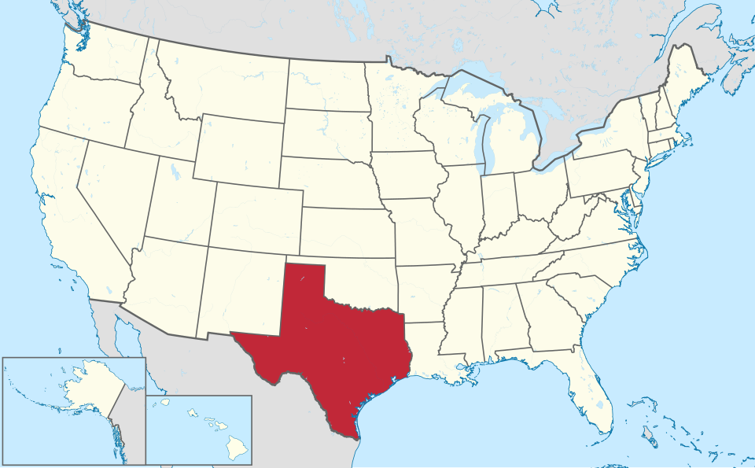
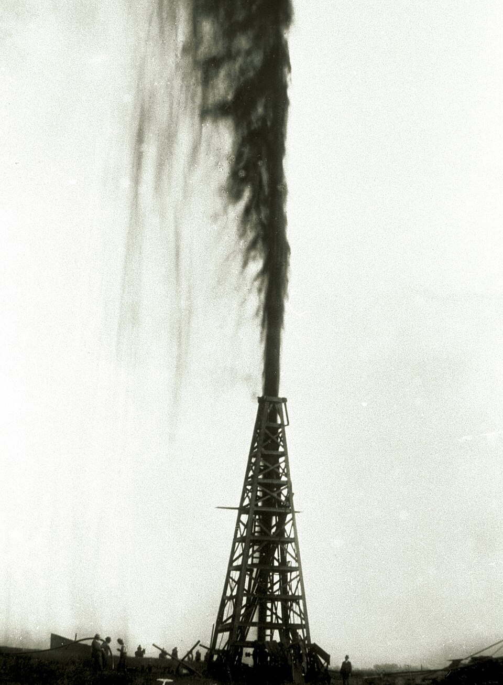
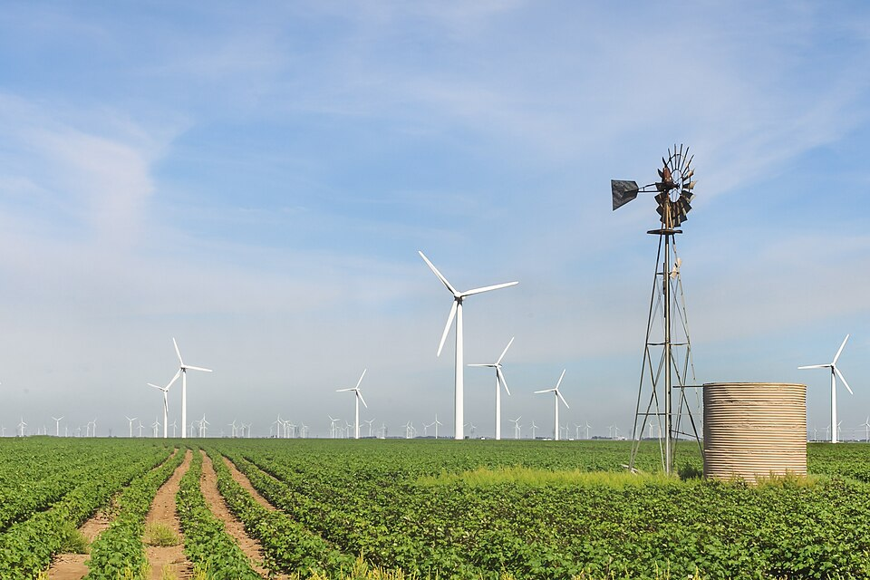
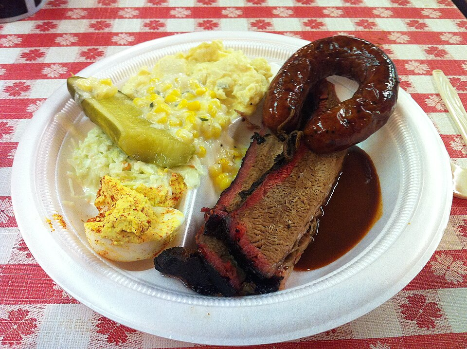

# テキサス

地図でアメリカを眺めるとき、テキサスを探す手間はいらない。南にぶら下がった、いちばん目立つ大きな塊がそれである。

*アメリカの中のテキサス(地図: TUBS, CC BY-SA 3.0)*

| プロフィール | |
|---|---|
| 州都 | オースティン |
| 最大都市 | ヒューストン(全米4位) |
| 人口 | 約3,100万(2025年時点・全米2位) |
| 面積 | 約70万平方キロメートル(日本の約1.8倍・全米2位) |
| 隣り合うもの | 東からルイジアナ、アーカンソー、オクラホマ、ニューメキシコの各州。南はリオグランデ川を挟んでメキシコ |
| 気候 | 東は湿潤、西へ行くほど乾燥。メキシコ湾岸はハリケーンの通り道 |
| 愛称 | ローンスター・ステート(ひとつ星の州) |

## 1 カウボーイの州、と誰もが言う

テキサスと聞いて浮かぶのは、つばの広い帽子と牛の群れだろう。その印象は正しい。ただし、百二十年ほど古い。

十九世紀のテキサスは、たしかに牛の州だった。広い草原で牛を育て、北の鉄道駅まで何千頭も歩かせて運ぶ。それを仕事にした男たちがカウボーイである。ついでに言えば、この州はアメリカに加わる前、九年間だけ「テキサス共和国」という独立国だった。州旗に星がひとつだけ描かれているのは、その名残である。一度国だったという記憶は、いまもこの州の気風に残っている。

*テキサス州旗。星はひとつだけ(パブリックドメイン)*

転機は1901年に来る。州の東部、スピンドルトップという丘で井戸を掘っていた男たちが、水ではなく、黒い液体の噴出に出くわした。石油である。やぐらの高さを超えて噴き上がる油は、九日間止まらなかった。牛を追っていた州は、この日から、掘る州になった。

*1901年1月、スピンドルトップの噴出。やぐらの倍以上の高さまで噴き上がっている(パブリックドメイン)*

## 2 なぜ宇宙センターはヒューストンにあるのか

月に着陸した宇宙船が最初に呼びかけた相手は、ワシントンでもフロリダでもなく、テキサスの都市だった。「ヒューストン、こちら静かの海基地」。以来、ヒューストンは宇宙の代名詞である。

だが、考えてみてほしい。ロケットの打ち上げはフロリダで行う。なぜ管制はテキサスなのか。広いから、ではない。広い土地なら、アメリカにはいくらでもある。

答えは、石油が集めたものの側にある。石油はヒューストンを全米有数の工業都市と港に育て、金と人と大学を集め、そして政治力を育てた。1960年代、宇宙センターの誘致合戦を制したのは、テキサス出身の副大統領ジョンソンの影響力と、地元の大学が差し出した広大な土地である。宇宙は、空から降ってきたのではない。石油の上に建ったのである。

## 3 カウボーイは、いま風を追う

いまも石油はテキサスの心臓である。アメリカで採れる原油の、およそ4割がこの州から出る。

それでは、と次の問いを置こう。風力発電の発電量が全米一位の州はどこか。環境先進のカリフォルニアあたりを思い浮かべたなら、はずれである。答えはテキサス。石油の州は、風の州でもある。

種を明かせば単純で、カウボーイが牛を追ったあの草原は、さえぎるもののない風の通り道だった。牛を放しても、油田を掘っても、風車を立てても稼げる。テキサスの強さの正体は、結局のところ、あの広い土地が一度も遊んでいないことにある。

*西テキサス、ロスコーの風力発電所。手前に立つ小さな風車は、牧場で井戸の水を汲み上げるための昔ながらのもの。新旧の「風の使い方」が一枚に収まっている(写真: Matthew T Rader, matthewtrader.com, CC BY-SA 4.0)*

ついでに言うと、この州は電力網まで自前である。アメリカ本土の送電網は東西二つの大きなまとまりでできているが、テキサスだけは、そのどちらにも属さない独自の網を運用している。国だった記憶は、コンセントの中にも残っているわけだ。もっとも2021年の大寒波では、この独立ぶりが裏目に出て大停電を起こしもした。独立には、独立の代償がある。

## 4 リオグランデの向こうとこちら

ここまでは、テキサスの片方の顔の話である。もう片方の顔は、南の国境から来る。

そもそもこの土地は、スペイン領であり、ついでメキシコ領だった。そこへアメリカから入植者がなだれ込み、1836年に独立を宣言する(このときの籠城戦「アラモの戦い」は、いまもテキサス人の誇りの物語である)。九年間の共和国を経てアメリカに併合されると、それが引き金になってアメリカとメキシコは戦争になり、1848年、国境はリオグランデ川と定められた。約2,000キロメートル。アメリカとメキシコの国境の、半分以上をテキサス一州が受け持っている。

地図を見れば、この歴史は地名に残っているのが分かる。サンアントニオ、エルパソ、アマリロ、そしてリオグランデ——みなスペイン語である。西の端の街エルパソは、川の対岸のメキシコの街シウダーフアレスと、橋でつながった双子の都市になっている。

人もまた、国境の両側で続いている。2025年時点で、テキサスの人口のおよそ4割がヒスパニック——スペイン語圏にルーツを持つ人々——であり、2020年代に白人を抜いて州で最大の集団になった。貿易でも、テキサスの最大の相手国はメキシコである。カウボーイと石油の州は、同時に、アメリカで最もメキシコと結びついた州でもある。

## 5 いまも、人が向かう州

テキサスの人口は約3,100万(2025年時点)。カリフォルニアに次ぐ全米二位で、しかも増え続けている。州の所得税がなく、土地が安く、仕事があるからだ。大企業が本社ごと引っ越してくる例も相次いだ。

その受け皿のひとつが、州都オースティンである。ここで意外に思った読者もいるだろう——テキサスの州都は、ヒューストンでもダラスでもない。州内で四番手の規模の、この学園都市である。近年はIT企業が集まり「シリコンヒルズ」と呼ばれるようになった。十九世紀に牛で、二十世紀に石油で人を呼んだ州は、二十一世紀にはコンピュータで人を呼んでいる。呼ぶ手段が変わるだけで、この州は昔から、人が一旗揚げに行く場所なのである。

## 6 それでも、牛の州である

最後に、食べ物の話をしよう。ここまで読んで心配になった読者のために言っておくと、牛はいまもテキサスにいる。飼育頭数は全米一位。食卓の上では、この州は今も堂々たる牛の州である。

名物はバーベキュー。牛肉の塊に塩と胡椒をすり込み、煙で半日以上いぶすブリスケットは、名店の前に朝から行列を作らせる。

*ブリスケットとソーセージの皿。テキサス中部ロックハートの老舗にて(写真: Heather Cowper, CC BY 2.0)*

もうひとつの名物はテックスメックス。メキシコ料理と思われがちだが、テキサスで生まれた別の料理である。チリコンカンも、皮の硬いタコスも、実はメキシコではなくこちらの出身だ。もっとも、4節を読んだ読者には、この料理がなぜここで生まれたのか、もう見当がついているだろう。国境の州には、国境の料理があるのである。

牛から始まり、石油で化け、宇宙を呼び、風で稼ぐ。それがテキサスの一つ目の顔。リオグランデの向こうから地名と人と料理が続いているのが、二つ目の顔。二つ合わせて覚えておけば、この州はだいたい説明がつく。ただし食事だけは、最初から最後まで牛である。

<!--
検証メモ(場には出さない編集用注記)
- スピンドルトップ(ボーモント近郊)の噴出は1901年1月。ルーカス・ガッシャーは約9日間噴出。
- テキサス共和国 1836-1845(約9年)。州旗のローンスター(ひとつ星)は共和国期由来。
- アラモの戦い 1836年。併合1845年→米墨戦争1846-48年→グアダルーペ・イダルゴ条約(1848)で
  リオグランデ川が国境に。テキサス=メキシコ国境は約1,254マイル≒約2,000km(米墨国境全体約3,140kmの過半)。
- アポロ11号着陸第一報「Houston, Tranquility Base here. The Eagle has landed.」
- ジョンソン宇宙センター: 1961年立地決定。ライス大学が提供した土地(元はハンブル石油の寄贈)、
  テキサス出身の副大統領リンドン・ジョンソンの政治的影響が広く記録されている。
- 原油生産: テキサスは全米の約4割(2025年、EIA基準で42.3%)。
- 風力発電量: テキサスが全米1位(発電量ベース。2026年5月時点でも全米の約27%)。
- 電力網: ERCOTは東西インターコネクションから独立した独自系統(州需要の約9割をカバー)。
  2021年2月の大寒波(冬の嵐ウリ)で大規模停電。
- 人口約3,100万(2025年時点)、全米2位。ヒスパニック約40%で2020年代に非ヒスパニック白人を
  上回り州内最大集団に(米センサス局推計)。
- メキシコはテキサス州の最大貿易相手国。エルパソ/シウダーフアレスは国境の双子都市。
- オースティン: 州都。州内人口4位(ヒューストン、サンアントニオ、ダラスに次ぐ)。
  「シリコンヒルズ」の呼称、2021年テスラ本社移転など。州個人所得税なし。
- 牛飼育頭数全米1位。ブリスケット(セントラルテキサス式、塩胡椒ラブ、12時間前後の燻製)。
- チリコンカン(サンアントニオ発祥とされる)、ハードシェルタコスはテックスメックス起源。
- 面積約69.6万km²(アラスカに次ぐ全米2位)、日本(約37.8万km²)の約1.8倍。
- 図版: tx-locator.png=Texas in United States.svg(TUBS, CC BY-SA 3.0)/tx-flag.png=PD/
  tx-lucas-gusher.jpg=Lucas gusher.jpg(1901, PD)/tx-wind-roscoe.jpg=Roscoe Wind Farm in West
  Texas.jpg(Matthew T Rader, CC BY-SA 4.0)/tx-brisket.jpg=Sausage, brisket and sides from
  Black's Barbecue.jpg(Heather Cowper, CC BY 2.0)
執筆: 2026-08-14(v2: プロフィール欄・図版・4節を追加、時点表記を「2025年時点」に統一)
-->
